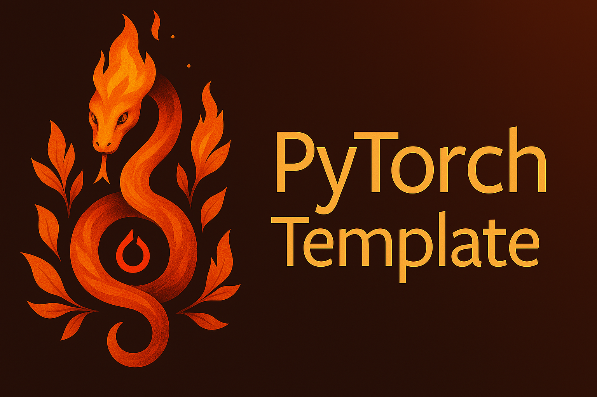

# PyTorch Template

[](https://opensource.org/licenses/MIT)
[](https://github.com/tctibbs/template_pytorch/actions/workflows/ci.yml)

A modern PyTorch project template with automated development workflows and quality tools.

## Features

- **Modern Build System**: Uses `hatchling` with `uv` for fast dependency management
- **Code Quality**: Integrated linting and formatting with Ruff
- **Automation**: Makefile commands for common development tasks
- **Pre-commit Hooks**: Automated code quality checks before each commit
- **DevContainer Support**: Ready-to-use development environment with Docker and VSCode

---

## Quick Start

### Prerequisites
- Python 3.11+
- [`uv`](https://docs.astral.sh/uv/getting-started/installation/) - Fast Python package installer

### Setup
```bash
git clone <your-repo-url>
cd template_pytorch
make install
```

### Development Commands
```bash
make help     # Show all available commands
make lint     # Run linting and static analysis
make format   # Format code and fix issues
make test     # Run test suite
make clean    # Remove build artifacts
```

---

## Documentation

For detailed development setup, project structure, and contribution guidelines, see [DEVELOPMENT.md](DEVELOPMENT.md).
